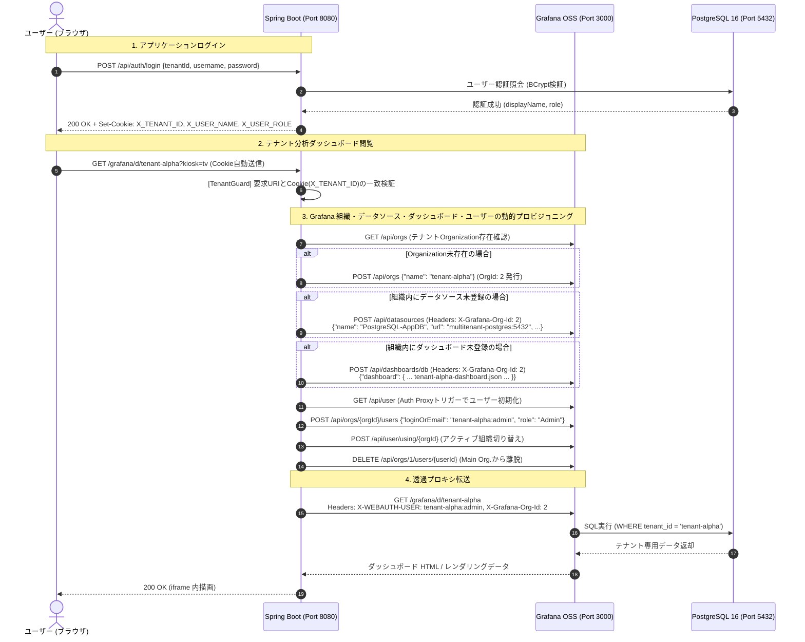

# マルチテナント環境における Grafana 連携 詳細仕様書

## 1. 概要と目的

### 1.1 目的
本仕様書は、Spring Boot 3.x + PostgreSQL 16 によるマルチテナントWebサービス基盤において、**Grafana OSS** をメトリクス・データ可視化基盤として統合・連携するためのシステムアーキテクチャ、認証・認可、マルチテナント分離機構、動的プロビジョニング（自己修復・Self-healing アーキテクチャ）、および運用手順を定義するものです。

### 1.2 達成要件
1. **ユーザー認証の一元化 (透過 SSO)**: ユーザーは当アプリケーション側でログインし、Grafana 側のログイン画面を一切介さないシングルサインオン（SSO）を実現する。
2. **完全なテナント分離 (Organization 分離 & URL ガード)**:
   - テナントごとに Grafana の Organization を独立させ、自テナントのダッシュボード・データソースのみを閲覧・管理可能とする。
   - 他テナントのダッシュボードが一覧に漏洩したり、直接 URL でアクセスされたりしない二重防御機構。
3. **ロール・アクセス制御 (RBAC) の自動連動**:
   - アプリケーション側の権限（`ADMIN` / `USER`）に応じ、Grafana 側のロール（`Admin` / `Viewer`）を自動同期する。
4. **コンテナ化と動的自動プロビジョニング (Self-healing)**:
   - ホスト環境に事前インストールを要求せず、コンテナ起動時に設定が整合。
   - Grafana の未作成組織による起動クラッシュ（`[org.notFound]`）を排除し、アクセス時に Organization、PostgreSQL データソース、および専用ダッシュボードを **Grafana REST API 経由で完全自動構築** する自己修復（Self-healing）アーキテクチャ。

---

## 2. システムアーキテクチャ

### 2.1 全体構成図

```mermaid
flowchart TB
    subgraph Client ["クライアント (ブラウザ)"]
        SPA["SPA フロントエンド<br>(HTML5 / Modern CSS / Vanilla JS)"]
        IFrame["Grafana 埋め込み iframe<br>(/grafana/d/{tenantId}?kiosk=tv)"]
    end

    subgraph AppServer ["Spring Boot アプリケーション (Port 8080)"]
        AuthCtrl["AuthController<br>(/api/auth/login)"]
        ProxyCtrl["GrafanaProxyController<br>(/grafana/** 透過リバースプロキシ)"]
        SyncSvc["GrafanaSyncService<br>(Org / DS / Dashboard / User 自動プロビジョニング)"]
        TenantGuard["テナント隔離ガード<br>(他テナント UID 検証 & 403 遮断)"]
        Resources["バンドルダッシュボード定義<br>(classpath:dashboards/*.json)"]
    end

    subgraph DBServer ["PostgreSQL 16 (Port 5432)"]
        DB[(appdb<br>Row-level Multi-tenancy)]
    end

    subgraph GrafanaServer ["Grafana OSS 10.4 (内部 Port 3000)"]
        AuthProxy["Auth Proxy モジュール<br>(X-WEBAUTH-USER 検証)"]
        OrgAlpha["Organization: tenant-alpha (OrgId: 2)<br>Role: Admin / Viewer"]
        OrgBeta["Organization: tenant-beta (OrgId: 3)<br>Role: Admin / Viewer"]
        Datasource["PostgreSQL-AppDB<br>(各 Org に動的自動プロビジョニング)"]
    end

    SPA -->|1. ログイン認証 (X-Tenant-ID)| AuthCtrl
    AuthCtrl -->|Cookie発行: X_TENANT_ID, X_USER_NAME, X_USER_ROLE| SPA
    IFrame -->|2. ダッシュボード要求 (Cookie付与)| ProxyCtrl
    ProxyCtrl -->|3. テナント検証| TenantGuard
    ProxyCtrl -->|4. テナント同期・プロビジョニング要求| SyncSvc
    SyncSvc -->|5a. Org / DS / Dashboard API 登録| GrafanaServer
    SyncSvc -.->|JSON 読み込み| Resources
    ProxyCtrl -->|6. X-WEBAUTH-USER + X-Grafana-Org-Id 付与転送| AuthProxy
    AuthProxy --> OrgAlpha
    AuthProxy --> OrgBeta
    OrgAlpha -->|7. SQL クエリ (WHERE tenant_id='tenant-alpha')| DB
    OrgBeta -->|7. SQL クエリ (WHERE tenant_id='tenant-beta')| DB
```

### 2.2 通信シーケンス



---

## 3. 認証 & シングルサインオン (SSO) 仕様

### 3.1 認証フロー
1. クライアントは当アプリケーションのログイン API（`POST /api/auth/login`）を呼び出し、`tenantId`, `username`, `password` で認証を行います。
2. 認証成功時、Spring Boot 側で以下の Cookie をクライアントへ発行します（Path: `/`）：
   - `X_TENANT_ID`: ログインしたテナント ID（例: `tenant-alpha`）
   - `X_USER_NAME`: ログインしたユーザー名（例: `admin`）
   - `X_USER_ROLE`: アプリケーションでの権限（`ADMIN` または `USER`）
3. クライアントが `/grafana/**` への要求を行う際、同一オリジン（Port 8080）であるため上記 Cookie が自動的に送信されます。

### 3.2 Grafana Auth Proxy 仕様
Grafana OSS の `[auth.proxy]` 機能を利用し、Spring Boot プロキシが付与する HTTP ヘッダーにより認証します。

| 設定項目 (環境変数) | 設定値 | 説明 |
|---|---|---|
| `GF_AUTH_PROXY_ENABLED` | `true` | Auth Proxy 認証を有効化 |
| `GF_AUTH_PROXY_HEADER_NAME` | `X-WEBAUTH-USER` | ユーザー識別用ヘッダー名 |
| `GF_AUTH_PROXY_HEADER_PROPERTY` | `username` | ヘッダー値をユーザー名として解釈 |
| `GF_AUTH_PROXY_AUTO_SIGN_UP` | `true` | ヘッダー検知時にユーザーが存在しなければ自動作成 |
| `GF_AUTH_PROXY_ENABLE_LOGIN_TOKEN` | `false` | セッショントークン依存を無効化 |
| `GF_USERS_ALLOW_SIGN_UP` | `false` | 一般ユーザーの自己登録画面を無効化 |

> [!IMPORTANT]
> **ユーザー名の名前空間分離**
> 異なるテナントで同一のユーザー名（例: `admin`）が存在しても Grafana 側で競合しないよう、ヘッダーには `{tenantId}:{username}`（例: `tenant-alpha:admin`）を注入して一意性を担保します。

---

## 4. マルチテナント組織 (Organization) 分離仕様

### 4.1 なぜ Organization 分離が必要か
Grafana のデフォルト構成（`Main Org.` のみ）では、ダッシュボードプロバイダが読み込んだすべてのダッシュボードが一覧に表示されてしまいます。
Grafana の **Organization** 境界を利用することで、以下の完全分離を達成します：
- **ダッシュボード一覧の分離**: 組織 `tenant-alpha` に所属するユーザーには、`Tenant Alpha` のダッシュボードのみが表示される。
- **データソースの分離**: 組織ごとに個別のデータソースインスタンスが紐付けられる。
- **設定・アラートの分離**: 組織間での設定漏洩や誤操作を完全に排除。

### 4.2 Organization 自動同期仕様 (`GrafanaSyncService`)
Spring Boot の `GrafanaSyncService` は、リクエストを透過プロキシする直前に以下の処理を自動実行します：

1. **Organization の検証と自動生成**:
   - `GET /api/orgs` を呼び出し、対象テナント（例: `tenant-alpha`）の Organization が存在するか確認。
   - 未存在の場合、`POST /api/orgs` で自動作成。
2. **組織専用リソースの動的プロビジョニング**:
   - 対象 Organization 内に `PostgreSQL-AppDB` データソースが存在するか確認し、なければ API 登録。
   - 対象 Organization 内にテナント専用ダッシュボードが存在するか確認し、なければクラスパスの JSON を API 登録。
3. **ユーザーの Organization アサイン**:
   - ユーザー（例: `tenant-alpha:admin`）を対象 Organization に指定ロールで追加（`POST /api/orgs/{orgId}/users`）。
4. **アクティブ Organization の切り替え**:
   - ユーザーのデフォルトアクティブ組織を対象 Organization に切り替え（`POST /api/user/using/{orgId}`）。
5. **Main Org. からの離脱**:
   - Grafana が新規ユーザー作成時に自動登録してしまう `Main Org.`（orgId: 1）からユーザーを削除（`DELETE /api/orgs/1/users/{userId}`）。
6. **コンテキストヘッダーの注入**:
   - Grafana へのプロキシ転送リクエストに `X-Grafana-Org-Id: {orgId}` を常時注入。

---

## 5. 権限 (RBAC) マッピング仕様

当アプリケーションのロール体系と Grafana のロール体系を以下のように自動マッピングします。

| アプリケーション権限 (`users.role`) | Grafana ロール (`org_users.role`) | Grafana ダッシュボードでの許可操作 |
|---|---|---|
| **`ADMIN`** | **`Admin`** | ダッシュボードの閲覧、編集、新規作成、パネル調整、データソース確認 |
| **`USER`** | **`Viewer`** | ダッシュボードの閲覧、時間範囲変更、リフレッシュのみ（設定変更・編集不可） |

- ユーザーの権限変更（例: 一般ユーザーから管理者への昇格）が発生した場合も、次回のプロキシアクセス時に `PATCH /api/orgs/{orgId}/users/{userId}` により自動更新されます。

---

## 6. プロビジョニング構成仕様

### 6.1 設計の変遷と自己修復（Self-healing）アーキテクチャ

#### 静的プロビジョニングの課題
初期設計では `grafana/provisioning/datasources/datasource.yaml` や `dashboard-provider.yaml` に固定で `orgId: 2`, `orgId: 3` を記述していました。
しかし、Grafana は初回起動時（初期 DB 状態）に `orgId: 1`（Main Org.）しか存在しないため、未作成の組織 ID を読み込もうとして **`[org.notFound] failed to get org by ID: 2`** という Fatal エラーでコンテナ起動直後にクラッシュしてしまう問題が発生しました。

#### 動的自動プロビジョニング方式への刷新
この問題を解決するため、**静的な未存在 orgId プロビジョニングを廃止** し、以下の完全自動構成アーキテクチャに進化させました：

1. **Grafana 起動設定のシンプル化:**
   - `datasource.yaml` は初期起動時の Main Org (`orgId: 1`) 用のみとし、接続先を `multitenant-postgres:5432` に設定。
   - `dashboard-provider.yaml` は空配列 (`providers: []`) とし、Grafana 本体の初回起動クラッシュを 100% 防止。
2. **Spring Boot による動的プロビジョニング (`GrafanaSyncService`):**
   - テナントアクセス時に `GrafanaSyncService` が Grafana REST API を呼び出し、該当組織専用のデータソースとダッシュボードを**オンデマンドで自動作成・登録**。
   - コンテナを何度初期化・再起動しても、ユーザーの初回アクセス時に自己修復（Self-healing）され、常に正常動作します。

### 6.2 ディレクトリ配置

```text
├── grafana/
│   ├── dashboards/                       # ホスト側参照用ダッシュボード定義
│   │   ├── alpha/
│   │   │   └── tenant-alpha-dashboard.json
│   │   └── beta/
│   │       └── tenant-beta-dashboard.json
│   └── provisioning/
│       ├── dashboards/
│       │   └── dashboard-provider.yaml   # 空プロバイダ設定 (起動クラッシュ防止)
│       └── datasources/
│           └── datasource.yaml           # Main Org (orgId: 1) 向け初期データソース設定
└── src/main/resources/
    └── dashboards/                       # Spring Boot バンドル用ダッシュボード定義
        ├── tenant-alpha-dashboard.json   # classpath 経由で Grafana REST API に自動投入
        └── tenant-beta-dashboard.json
```

### 6.3 データソース自動登録仕様 (`POST /api/datasources`)
`GrafanaSyncService` は、対象 Organization（`orgId`）内に `PostgreSQL-AppDB` が未登録の場合、以下のリクエストを自動発行します。

- **Headers:**
  - `Authorization: Basic {admin:admin}`
  - `X-Grafana-Org-Id: {orgId}`
  - `Content-Type: application/json`
- **Body:**
  ```json
  {
    "name": "PostgreSQL-AppDB",
    "uid": "PostgreSQL-AppDB",
    "type": "postgres",
    "access": "proxy",
    "url": "multitenant-postgres:5432",
    "database": "appdb",
    "user": "appuser",
    "secureJsonData": {
      "password": "apppassword"
    },
    "jsonData": {
      "sslmode": "disable",
      "postgresVersion": 1600
    },
    "isDefault": true
  }
  ```
  ※ 接続先 URL・データベース名・認証情報は Spring Boot の `SPRING_DATASOURCE_*` 設定から動的にパース・解決されます。

### 6.4 ダッシュボード自動登録仕様 (`POST /api/dashboards/db`)
`GrafanaSyncService` は、対象 Organization 内に対象テナントのダッシュボード（`uid: {tenantId}`）が未登録の場合、クラスパス（`classpath:dashboards/{tenantId}-dashboard.json`）から JSON を読み込み、以下のリクエストを発行します。

- **Headers:**
  - `Authorization: Basic {admin:admin}`
  - `X-Grafana-Org-Id: {orgId}`
  - `Content-Type: application/json`
- **Body:**
  ```json
  {
    "dashboard": { ... ダッシュボード JSON オブジェクト ... },
    "overwrite": true
  }
  ```
  ※ クラスパスに個別ダッシュボード JSON が存在しないテナントの場合でも、汎用の統計・アイテム集計パネルを持つフォールバックダッシュボードが自動生成・登録されます。

### 6.5 ダッシュボードクエリ仕様
PostgreSQL の行レベルマルチテナント設計に従い、各パネルの SQL クエリには対象テナント ID 条件を明示します。

- **アイテム総数パネル:**
  ```sql
  SELECT count(*) AS "登録アイテム総数" FROM items WHERE tenant_id = 'tenant-alpha';
  ```
- **所属ユーザー総数パネル:**
  ```sql
  SELECT count(*) AS "有効ユーザー数" FROM users WHERE tenant_id = 'tenant-alpha';
  ```
- **時系列登録推移パネル:**
  ```sql
  SELECT date_trunc('hour', created_at) AS "time", count(*) AS "登録件数"
  FROM items
  WHERE tenant_id = 'tenant-alpha'
  GROUP BY 1 ORDER BY 1;
  ```
- **最新登録アイテム一覧パネル:**
  ```sql
  SELECT id AS "ID", name AS "アイテム名", description AS "説明", created_at AS "作成日時"
  FROM items
  WHERE tenant_id = 'tenant-alpha'
  ORDER BY created_at DESC LIMIT 10;
  ```

---

## 7. セキュリティ & テナント分離ガード仕様

### 7.1 プロキシ層による多層防御 (`GrafanaProxyController`)
Grafana のダッシュボード URL は推測可能な構造（`/grafana/d/{uid}/...`）を持ちます。悪意あるユーザーが URL を直接改ざんして他テナントのダッシュボードを閲覧しようとした場合、Spring Boot プロキシ層で即座に検知・遮断します。

```java
// テナント隔離検証ロジック (抜粋)
if (requestUri.contains("/d/tenant-") || requestUri.contains("/dashboards/uid/tenant-")) {
    String normalizedTenant = tenantId.toLowerCase().startsWith("tenant-")
            ? tenantId.toLowerCase()
            : "tenant-" + tenantId.toLowerCase();
    if (!requestUri.toLowerCase().contains(normalizedTenant)) {
        log.warn("テナントアクセス違反検知: ユーザー所属テナント={}, 要求URI={}", tenantId, requestUri);
        response.setStatus(HttpServletResponse.SC_FORBIDDEN);
        response.setContentType("application/json;charset=UTF-8");
        response.getWriter().write("{\"error\": \"Forbidden: You cannot access other tenant's dashboard.\"}");
        return;
    }
}
```

### 7.2 ネットワーク層の隠蔽
- 本番環境では、Grafana のポート（3000）をホスト側にバインド（公開）せず、コンテナネットワーク（`multitenant-net`）内のみの通信に限定することが推奨されます。
- クライアントは必ず Spring Boot アプリケーション（Port 8080）の認証・認可フィルターを経由してのみアクセスできるため、Grafana への直接侵入やヘッダー改ざん（`X-WEBAUTH-USER` の偽装）が防止されます。

### 7.3 クリックジャッキング対策と埋め込み設定
- `GF_SECURITY_ALLOW_EMBEDDING=true` を指定して iframe 埋め込みを許可しつつ、同一オリジンプロキシ（Port 8080）経由で通信させることで、ブラウザのクロスオリジン制約（SameSite Cookie, CORS）を安全に回避します。

---

## 8. コンテナ構成 & 環境変数リファレンス

### 8.1 Grafana コンテナ環境変数一覧

| 環境変数名 | 推奨値 | 説明 |
|---|---|---|
| `GF_SECURITY_ALLOW_EMBEDDING` | `true` | Web UI (iframe) 内への埋め込み表示を許可 |
| `GF_AUTH_PROXY_ENABLED` | `true` | Auth Proxy (ヘッダー認証) を有効化 |
| `GF_AUTH_PROXY_HEADER_NAME` | `X-WEBAUTH-USER` | プロキシから渡されるユーザー認証ヘッダー名 |
| `GF_AUTH_PROXY_HEADER_PROPERTY` | `username` | ユーザー名としてマッピング |
| `GF_AUTH_PROXY_AUTO_SIGN_UP` | `true` | 新規ユーザー検知時の自動アカウント生成 |
| `GF_AUTH_PROXY_ENABLE_LOGIN_TOKEN`| `false` | セッショントークンによる認証バイパスを抑止 |
| `GF_USERS_ALLOW_SIGN_UP` | `false` | ログイン画面からのユーザー新規登録を禁止 |
| `GF_SERVER_ROOT_URL` | `%(protocol)s://%(domain)s:%(http_port)s/grafana/` | サブパス `/grafana/` 運用のためのルートURL |
| `GF_SERVER_SERVE_FROM_SUB_PATH` | `true` | サブパス配信を有効化 |

### 8.2 ボリュームマウント一覧

| ホストパス | コンテナ内パス | 属性 | 用途 |
|---|---|---|---|
| `./grafana/provisioning` | `/etc/grafana/provisioning` | `ro` (Read Only) | Main Org データソース設定 (初期起動クラッシュ防止) |
| `./grafana/dashboards` | `/var/lib/grafana/dashboards` | `ro` (Read Only) | テナント別ダッシュボード定義 JSON (参照・バックアップ用) |

---

## 9. 運用・保守 & 新規テナント追加手順 (SOP)

動的自動プロビジョニングアーキテクチャの導入により、**Grafana の再起動や yaml ファイルの編集は一切不要** となりました。

### ステップ 1: アプリケーション側のシードデータ追加
`src/main/resources/db/migration/` の Flyway スクリプト（または DB）に新規テナントのユーザーを追加します。
```sql
INSERT INTO users (tenant_id, username, password_hash, display_name, role) VALUES
('tenant-gamma', 'admin', crypt('password123', gen_salt('bf', 10)), 'Grace (Gamma Admin)', 'ADMIN');
```

### ステップ 2: 専用ダッシュボード定義の追加 (任意)
- 新規テナント専用にカスタマイズしたダッシュボードを定義したい場合：
  `src/main/resources/dashboards/tenant-gamma-dashboard.json` を配置します（`uid: "tenant-gamma"`, SQL 内の `WHERE tenant_id = 'tenant-gamma'` を指定）。
- ※ JSON を配置しなかった場合でも、`GrafanaSyncService` のフォールバックロジックにより標準集計ダッシュボードが自動生成されます。

### ステップ 3: 完了 (ゼロタッチ・ゼロダウンタイム)
- 新規テナントユーザー（`tenant-gamma`）がブラウザからログインし、「サービス分析 (Grafana)」タブを開いた瞬間に、`GrafanaSyncService` が以下を全自動で実行します：
  1. Grafana に Organization `tenant-gamma` を自動作成
  2. PostgreSQL データソース `PostgreSQL-AppDB` を自動登録
  3. テナント専用ダッシュボードを自動登録
  4. ユーザーを `Admin` ロールとして所属させ、アクティブ組織に切り替え
- サーバー再起動なしで即座にテナント分離ダッシュボードが利用可能になります。

---

## 10. まとめ

本アーキテクチャにより、以下のエンタープライズ要件が満たされます：
1. **SSO**: ユーザーはアプリケーションログインのみで Grafana に透過アクセス可能。
2. **完全隔離**: Organization によるダッシュボード一覧の分離、および Spring Boot プロキシ層による URL 改ざん防止の二重防御。
3. **RBAC 連動**: 管理者と一般ユーザーで Grafana 側の操作権限が自動同期。
4. **自己修復性 (Self-healing)**: コンテナの初回起動クラッシュを排除し、アクセス時に Organization・データソース・ダッシュボードをオンデマンド自動構築。
